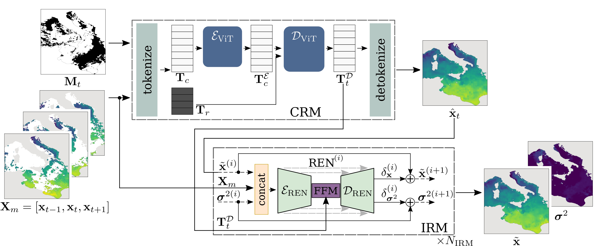

# CRITER — A coarse reconstruction with iterative refinement network for sparse spatio-temporal satellite data

## Pretrained Models

We offer pretrained checkpoints for the CRITER model, trained on various datasets. You can download them using the links below:

| Dataset        | Pretrained Checkpoint |
|----------------|----------------------|
| Mediterranean  | [download](https://drive.google.com/file/d/13ll0Sr5NR1qUtsuZu6C4B-NxjvPfmJ1u/view?usp=drive_link) |
| Adriatic       | [download](https://drive.google.com/file/d/1whCB9QL876SjW4afnXI-G0Q7DHOFrsVI/view?usp=drive_link) |
| Atlantic       | [download](https://drive.google.com/file/d/1qyYqte3QkOXwEdS-R1qYqFob3d4L7_Ki/view?usp=drive_link) |

## Datasets

The datasets used for training and testing the CRITER model are available for download:

| Dataset        | Download Link |
|----------------|---------------|
| Mediterranean  | [download](https://drive.google.com/file/d/1f35PqectvdRN4UsKrWSPb9vAIVZUMGhb/view?usp=drive_link) |
| Adriatic       | [download](https://drive.google.com/file/d/1iMk0lHHVhO43R6PJDtSk5cz7Ys0ej5Yv/view?usp=drive_link) |
| Atlantic       | [download](https://drive.google.com/file/d/1qyYqte3QkOXwEdS-R1qYqFob3d4L7_Ki/view?usp=drive_link) |
